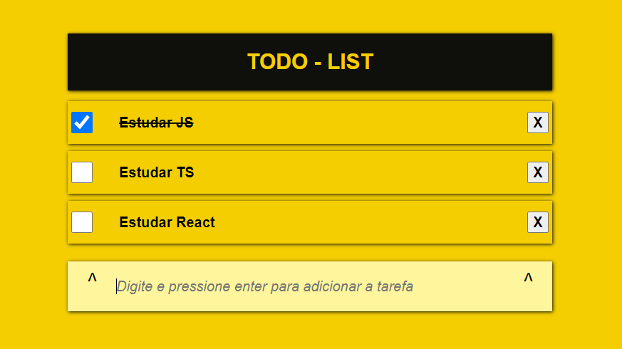

Créditos ao [video de Fernando Leonid](https://youtu.be/oGEYs52ZuHY) onde ensina a desenvolver uma Lista de Tarefas utilizando JavaScript. [Link do repositório original aqui!](https://github.com/fernandoleonid/mini-projetos-js/tree/master/07-todo-List)

Projeto simples, desenvolvido com o intuito de aprendizagem. Foram utilizadas as Linguagens HTML, CSS e JavaScript, com foco prícipal em JavaScript.

